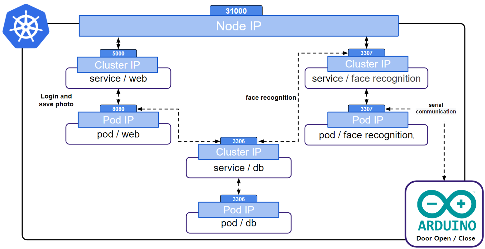
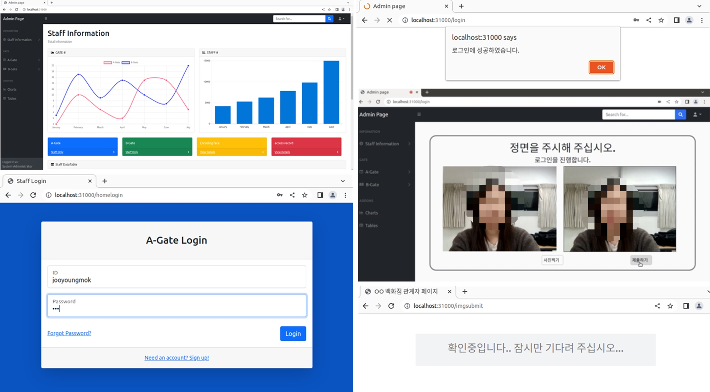
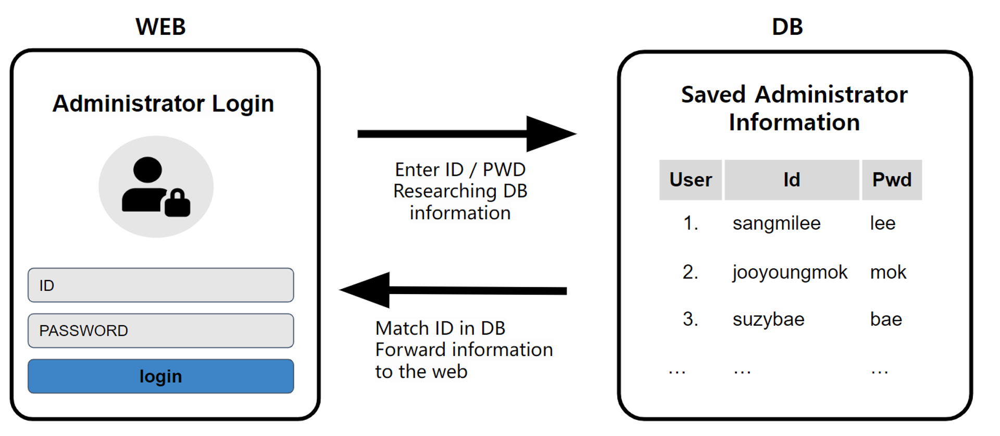
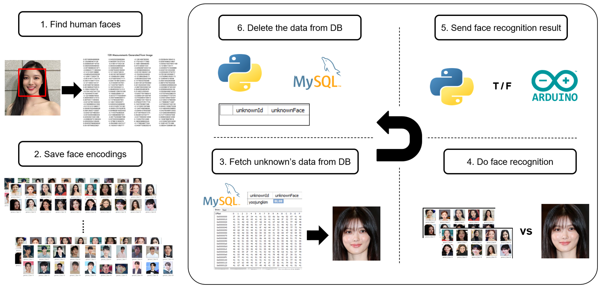
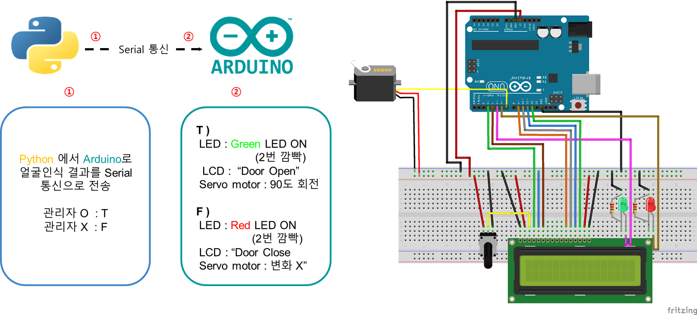
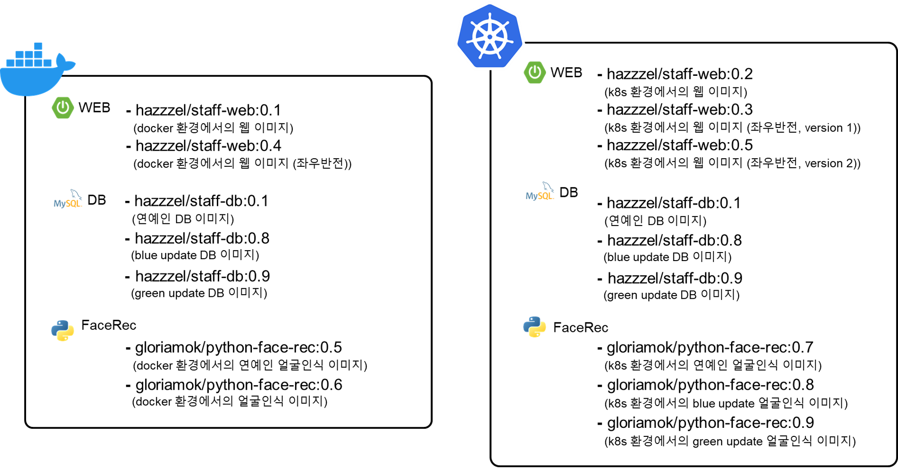

## 쿠버네티스 클러스터 환경에서의 얼굴인식 기반 출입관리 시스템 개발
> Development of Face Recognition based Access Control System in Kubernetes Cluster Environment

## 기획 배경 (기대 효과)
- 기존의 출입관리 시스템은:
  * 서버에 있는 데이터의 수정이 까다롭고 무중단 업데이트가 불가능해 오랜 시간과 높은 인건비가 발생합니다.
  * 서버에 문제가 생길 경우, 연결되어있는 시스템까지 장애가 생겨 관리자가 직접 그 장애를 복구해야 합니다.
- **쿠버네티스 클러스터 환경**과 **MSA** (Micro Service Architecture) 구조를 사용한 출입관리 시스템은:
  * 업데이트가 용이합니다.
  * 무중단 업데이트가 가능합니다.
  * 시스템 자동 복구가 가능합니다.

## 시스템 전체 구조
쿠버네티스와 MSA 기반 출입관리 시스템의 전체 구조는 다음과 같습니다.

## 웹 페이지
웹 페이지에서 아이디/비밀번호 로그인과 얼굴인식을 수행할 수 있습니다.

## 데이터베이스
아이디/비밀번호가 저장되어있고, 웹에서 찍은 사진이 저장됩니다.

## 얼굴인식
관계자 이미지와 웹에서 찍은 사진을 비교하여 얼굴인식 결과를 도출합니다.

## 아두이노로 결과 출력
얼굴인식 결과를 전송받아 출력합니다.

## 도커 이미지 버전
* 도커 어플리케이션 이미지를 도커와 쿠버네티스 환경에 맞게 빌드하여 관리합니다.
* 이미지는 DockerHub의 [gloriamok/python-face-rec](https://hub.docker.com/r/gloriamok/python-face-rec/tags)에서 다운받을 수 있습니다.

